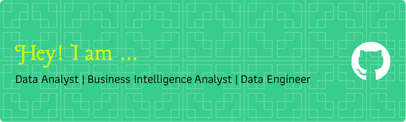

 <!-- Replace with your actual image link -->

# Hey there, I'm Het Shah 👋

### Data Analyst | Data Engineer | Business Intelligence Enthusiast

---

## 🙋‍♂️ About Me

🎓 I'm a recent graduate with a Master's in Business Analytics & Artificial Intelligence from The University of Texas at Dallas  
🧠 Passionate about uncovering insights that drive smart, strategic decisions using data  
🛠️ Hands-on experience working with ETL pipelines, cloud platforms (AWS, GCP), and business intelligence tools  
📈 At Infosys and Simple Recon, I led data-driven projects that optimized delivery, reduced reporting time, and unlocked operational efficiencies  
📊 Built scalable, automated dashboards and pipelines across tools like Power BI, Tableau, Snowflake, and Databricks  
🤖 Developed ML-based solutions and real-time streaming analytics using Kafka, PySpark, and AWS Redshift  
💬 Let's talk about data, pipelines, and turning raw numbers into actionable strategies!

📫 Reach me at: [shahhet006@gmail.com](mailto:shahhet006@gmail.com)  
🔗 [LinkedIn](https://www.linkedin.com/in/hetshah006/) | [GitHub](https://github.com/shahhet006)

Pronouns: he/him  
💡 Fun Fact: I love solving complex problems and continuously learning new tech!

---

## 🛠️ Languages and Tools

  
  
  
  
  
  
  
  
  
  
  

---

## 🚀 Projects & Highlights

- **Real-Time Weather Data Pipeline**: Built a serverless architecture using AWS Lambda, SQS, and Snowflake for ingesting real-time weather data  
- **Customer Review Intelligence**: Applied NLP and ML techniques to unstructured text, cutting analysis time by 68%  
- **YouTube Data Pipeline**: Streamed data via Kafka, transformed using PySpark, and analyzed in AWS Redshift  
- **Automated ETL Systems**: Delivered faster data flows integrating CRM, sales, and inventory systems  
- **Power BI Dashboards**: Enabled dealership performance visibility that reduced reporting time by 40%

---

## 🏅 Certifications

- 🎓 AWS Certified Solutions Architect – Associate  
- 📜 UTD Machine Learning Certificate  

---

⭐ *Let’s turn data into actionable stories. Connect with me and let’s collaborate!*
